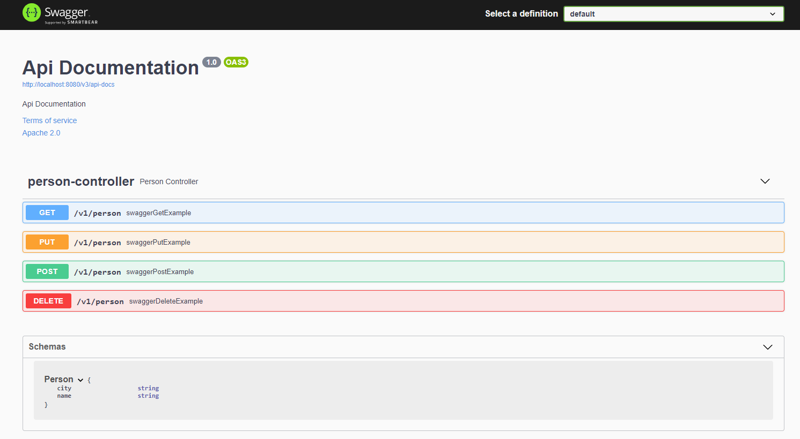

# Swagger Api Documentation

## Goal

Add swagger to a spring boot project.

## Step

### Step 1 : Add dependency

On a spring boot project we just need to add one dependency to get swagger.

```xml

<dependency>
    <groupId>io.springfox</groupId>
    <artifactId>springfox-boot-starter</artifactId>
    <version>3.0.0</version>
</dependency>
```

### Step 2 : Create some simple endpoint

We create basic endpoint for `GET/POST/PUT/DELETE` request.

```java
@RestController
@RequestMapping("/v1")
class PersonController {

    private final Flux<Person> allPerson = Flux.just(
            new Person("Anthony", "Paris"),
            new Person("Celia", "Paris"),
            new Person("Thomas", "Marseille")
    );

    @GetMapping("/person")
    Flux<Person> swaggerGetExample() {
        return allPerson;
    }

    @PostMapping("/person")
    Flux<Person> swaggerPostExample() {
        return allPerson;
    }

    @PutMapping("/person")
    Flux<Person> swaggerPutExample() {
        return allPerson;
    }

    @DeleteMapping("/person")
    Flux<Person> swaggerDeleteExample() {
        return allPerson;
    }
}
```

### Step 3 : Check swagger endpoint

Launch the app and go to `/swagger-ui/index.html` we should see the swagger interface with our endpoint.

